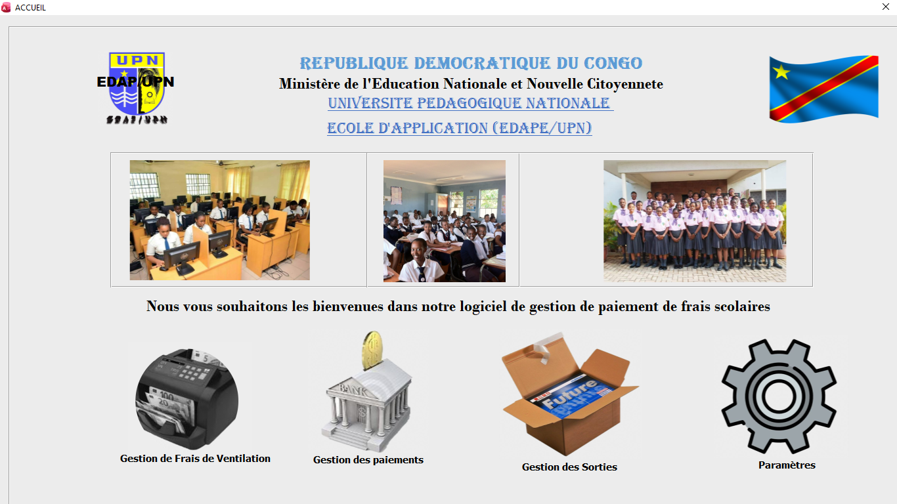
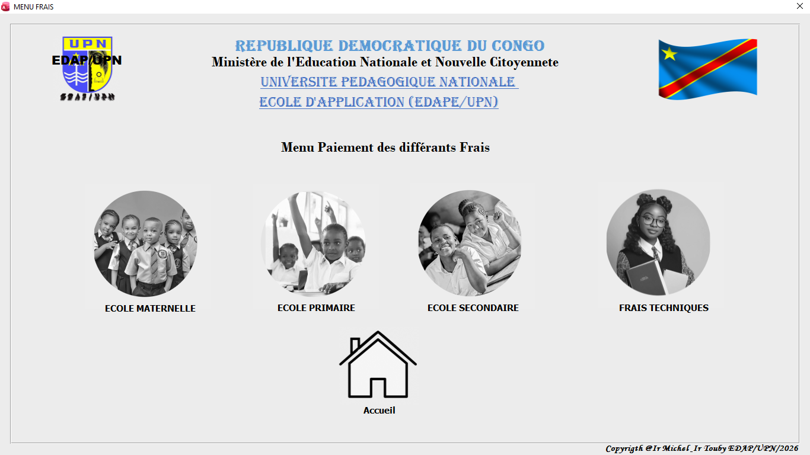
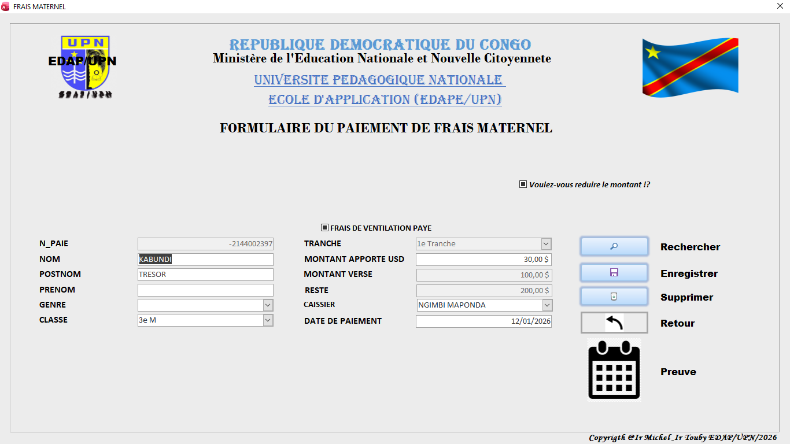
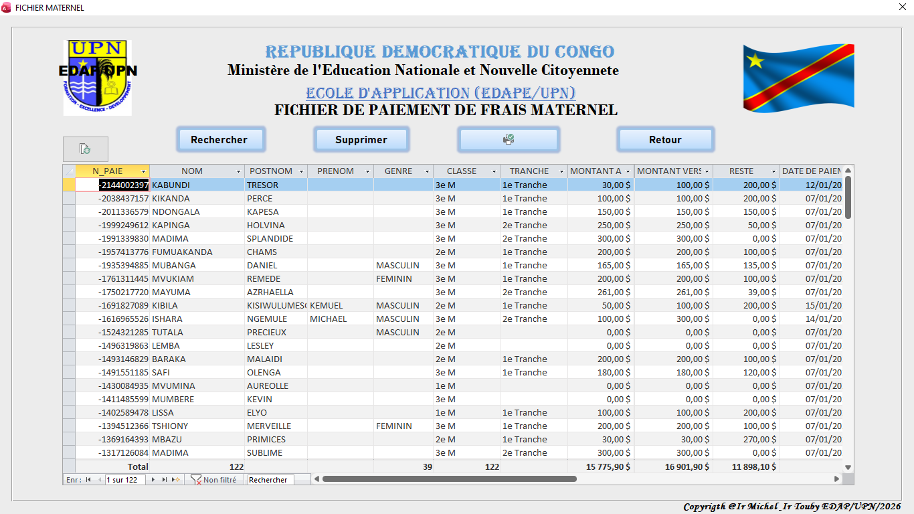
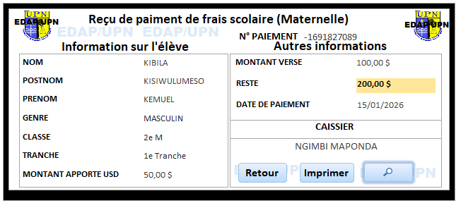

# Système de Gestion des Frais Scolaires (SGFS)

## Présentation

Gestion-Scolaire est une application développée avec VBA Access pour automatiser la gestion administrative d'un établissement scolaire.

## Fonctionnalités

* Gestion des élèves
* Gestion des inscriptions
* Gestion des frais scolaires
* Recherche rapide des dossiers
* Génération des rapports
* Gestion des paiements
* Suivi administratif
* Gestion d'accès
* Gestion des personnels 

## Technologies utilisées

* Microsoft Access
* VBA (Visual Basic for Applications)
* SQL

## Objectif

Cette application a été conçue pour simplifier le travail administratif des établissements scolaires et améliorer la gestion des informations académiques.

## Captures d'écran

### Page d'accueil

### Menu de paiement

### Formulaire de paiement

### Gestion des paiements

### Reçu de paiement

## Auteur
Ir Michel Jules Kabinda.

Développeur VBA Access et concepteur d'applications de gestion.

